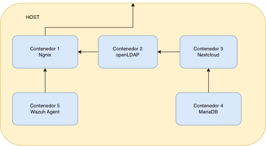

# SanRap

Nube privada auto-alojada para una PYME, construida con software libre sobre Docker: Nextcloud como almacenamiento, OpenLDAP como directorio central de identidades y Wazuh vigilando la integridad y los intentos de intrusión. Proyecto final de ASIR, pensado para dar soberanía real sobre los datos y cumplir RGPD sin depender de un proveedor externo.

## Diagrama de arquitectura



## Qué resuelve

SanRap parte de un caso real: una PYME con los datos de cada empleado repartidos entre discos duros externos y cuentas gratuitas de Google Drive/OneDrive, sin control de acceso por roles, sin bajas centralizadas cuando alguien se va de la empresa y sin ningún punto de entrada seguro hacia el exterior. Eso deja la integridad de los datos a merced de un fallo físico, la confidencialidad sin garantías de RGPD y la disponibilidad atada a que "el empleado con el disco duro" esté localizable.

SanRap centraliza el almacenamiento y la identidad, cifra el acceso externo y audita en tiempo real quién toca qué.

## Stack

| Capa | Tecnología |
|---|---|
| Proxy inverso / TLS | Nginx Proxy Manager + Let's Encrypt (ACME) |
| DNS dinámico | DuckDNS |
| Identidad | OpenLDAP + phpLDAPadmin |
| Almacenamiento | Nextcloud |
| Base de datos | MariaDB |
| Monitorización (SIEM/XDR + FIM) | Wazuh |
| Orquestación | Docker Compose |

## Arquitectura de red

El `compose.yaml` segmenta los servicios en tres redes Docker:

- **red-publica** (`bridge`): el único punto con puertos publicados al host (80, 4442→443, 81). La usan el proxy, phpLDAPadmin y Nextcloud para recibir tráfico externo.
- **red-privada** (`internal: true`): sin salida a internet ni acceso directo desde el host. Aquí viven OpenLDAP y MariaDB, solo alcanzables por los servicios que necesitan hablarles (Nextcloud, el proxy).
- **red-seguridad** (`external`): dedicada a la comunicación entre el agente Wazuh y el manager, separada del tráfico de archivos.

Detalle completo en [`docs/arquitectura.md`](docs/arquitectura.md).

## Decisiones técnicas

- **Docker Compose en vez de un hipervisor tipo Proxmox.** El stack no necesita distintos sistemas operativos por servicio, así que la virtualización completa solo añadía peso y tiempo de despliegue sin aportar nada a cambio.
- **Nginx Proxy Manager en vez de Traefik.** Traefik brilla con un número variable de contenedores efímeros (Kubernetes, microservicios que escalan); aquí el número de contenedores es fijo, y NPM tiene más documentación y comunidad para resolver dudas rápido.
- **OpenLDAP como fuente única de identidad.** Sin directorio centralizado, dar de baja a un empleado implica revisar servicio por servicio; olvidarse uno solo deja una cuenta activa que nadie vigila. Con LDAP la baja es un solo punto.
- **`red-privada` como red `internal: true`.** LDAP y MariaDB no tienen ninguna ruta de salida a internet ni son alcanzables desde el host o desde la red pública de Docker: solo Nextcloud puede hablarles. Si el proxy se ve comprometido, no hay movimiento lateral posible hacia los datos.
- **Port-forwarding 4442→4442 en el router + regla en el UFW del host.** El servidor está detrás de un router con NAT, así que sin una regla de reenvío de puertos (WAN 4442 → IP privada del host, puerto 4442) el tráfico externo nunca llega al proxy. Esa regla por sí sola no basta: el firewall del propio host (UFW) bloquea por defecto la entrada, así que hay que abrir explícitamente ese mismo puerto ahí también.

## Problemas encontrados y cómo los resolví

- **IP pública dinámica.** El router del ISP cambia de IP en cada reinicio, lo que rompía el acceso por dominio. Solución: un contenedor DuckDNS que actualiza el registro DNS cada pocos minutos.
- **Redirecciones rotas por el puerto no estándar.** Al exponer el proxy en un puerto distinto del 443 por defecto, Nextcloud generaba enlaces internos apuntando al puerto equivocado. Solución: `scriptInicio.sh`, que fija `trusted_domains` y `overwritehost` vía `occ` para que las URLs mantengan el puerto real.
- **El agente Wazuh ignoraba la configuración por variables de entorno.** El entrypoint del contenedor priorizaba el `ossec.conf` ya existente en el volumen sobre las variables pasadas por Compose, dando un error de "No client configured" en cada reinicio. Solución: un script que fuerza con `sed` la dirección del manager y el protocolo de transporte directamente en el `ossec.conf` persistido.
- **Conflictos de visibilidad entre las tres redes Docker.** Al segmentar en red pública/privada/seguridad aparecieron problemas iniciales de qué contenedor veía a cuál. Se resolvió afinando qué servicios pertenecen a cada red y aislando Wazuh en su propia red externa.

## Operación

- **Actualizaciones:** los contenedores se actualizan recreándolos con la imagen `latest` (`docker compose pull && docker compose up -d`), no se parchea nada en caliente dentro del contenedor.
- **Monitorización:** Wazuh vigila en tiempo real los logs de Nginx y Nextcloud (detecta fuerza bruta en el login) y hace FIM sobre los ficheros de configuración críticos. En pruebas, el stack completo consume ~3.2 GB de RAM en reposo.
- **Backups:** a día de hoy no hay una política de copias implementada; es el hueco más importante pendiente de cerrar (ver Próximos pasos).

## Despliegue rápido

```bash
cp .env.example .env      # rellena tus propios valores
docker compose up -d
./scriptInicio.sh 4442    # fuerza el puerto real en las URLs de Nextcloud
```

Guía completa, paso a paso, en [`docs/instalacion.md`](docs/instalacion.md).

## Documentación

- [Manual de instalación](docs/instalacion.md)
- [Manual de usuario](docs/manual-usuario.md)
- [Arquitectura y diseño](docs/arquitectura.md)

## Próximos pasos

- Backups inmutables con Restic o BorgBackup, siguiendo la regla 3-2-1.
- Clúster Galera para MariaDB, para eliminar el punto único de fallo actual.
- Gestión de secretos con Vault en vez de un `.env` en el sistema de archivos.
- SSO y MFA con Keycloak para el acceso administrativo.
